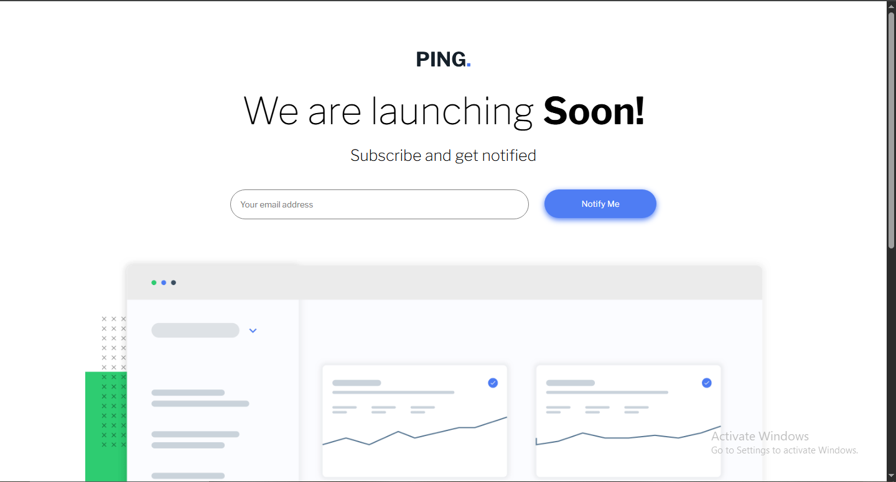

# Frontend Mentor - Ping coming soon page solution

This is a solution to the [Ping coming soon page challenge on Frontend Mentor](https://www.frontendmentor.io/challenges/ping-single-column-coming-soon-page-5cadd051fec04111f7b848da). Frontend Mentor challenges help you improve your coding skills by building realistic projects. 

## Table of contents

- [Overview](#overview)
  - [The challenge](#the-challenge)
  - [Screenshot](#screenshot)
  - [Links](#links)
- [My process](#my-process)
  - [Built with](#built-with)
  - [What I learned](#what-i-learned)
  - [Continued development](#continued-development)
- [Author](#author)


## Overview

### The challenge

Users should be able to:

- View the optimal layout for the site depending on their device's screen size
- See hover states for all interactive elements on the page
- Submit their email address using an `input` field
- Receive an error message when the `form` is submitted if:
	- The `input` field is empty. The message for this error should say *"Whoops! It looks like you forgot to add your email"*
	- The email address is not formatted correctly (i.e. a correct email address should have this structure: `example@email.com`). The message for this error should say *"Please provide a valid email address"*   

### Screenshot




### Links

- Live Site URL: [Ping-coming.com](https://wizdev0.github.io/Ping-coming/)

## My process

### Built with

- Semantic HTML5 markup
- CSS custom properties
- Flexbox
- CSS transition
- JavaScript
- Javascript event listeners


### What I learned

I learnt how to use transitions very well and also how to make my website very responsive to different screen sizes.


```css
/* Mobile */
@media only screen and (max-width: 480px) {
    
 .container{
    display: flex;
    flex-direction: column;
    justify-content: center;
    align-items: center;
 
    width: 80vw;
    margin: 0 auto;
    margin-top: 90px;
    margin-bottom: 100px;
}

/* WRITE UP */

.Write-up{
    margin-bottom: 60px;
    font-family: "Libre Franklin", sans-serif;
    text-align: center;

}

.write-up-h1{
    margin-bottom: 20px;
}

.write-h1{
    font-size: 30px;
    width: 100vw;
    font-weight: 100;
}

.highlight{
    font-weight: 700;
}

.write-p{
    font-size: 18px;
    font-weight: 200;
}

 
    /* FORM */

.form{
    display: flex;
    flex-direction: column;
    gap: 40px;
}

.form-wrapper{
    display: flex;
    flex-direction: column;
}

.input{
    padding: 15px;
    width: 80vw;
    border: 1px solid grey;
    border-radius: 40px;
   font-family: "Libre Franklin", sans-serif;
   outline: none;

   transition: border-color 0.5s ease-in 0s;
}

.input:focus{
    border-color:  hsl(223, 87%, 63%);
}

/* BUTTON */

.btn{
    padding: 15px;
    width: 80vw;
    margin-top: 20px;
    border: none;
    border-radius: 30px;
    color: white;
    background-color: hsl(223, 87%, 63%);
    font-family: "Libre Franklin", sans-serif;
    box-shadow: 0px 3px 10px hsl(223, 87%, 63%);

    transition: all 0.5s ease 0s;

}

.btn:hover{
    background-color:  hsl(223, 51%, 44%);
    cursor: pointer;
    scale: 1.1;
}


/* ERROR MESSAGE */
.error{
    display: flex;
    align-self: center;
    font-family: "Libre Franklin", sans-serif;
    
}

.error-mess{
    font-size: 14px;
    color: hsl(354, 100%, 66%);
    margin-top: -89px;
    display: none;

     
    
}

.stat{
    margin-top: 70px;
    width: 90vw;
    margin-bottom: 190px;
}


/* SOCIALS */

.social-btn{
    display: flex;
    gap: 45px;
}

.fa-brands{
    color: hsl(223, 87%, 63%);
    font-size: 17px;
    width: 40px;
    height: 40px;
    border: 1px solid grey;
    padding: 10px;
    border-radius: 60px;
    text-align: center;

    transition: all 0.5s ease-in 0s;
}

.fa-brands:hover{
    background-color: hsl(223, 87%, 63%);
    color: white;
    cursor: pointer;
}

/* RIGHTS */

.rights{
    margin-top: 30px;
    font-family: "Libre Franklin", sans-serif;
    color: grey;
}

}


/* Tablet */
@media (min-width: 768px) and (max-width: 1023px) {
    /* CONTAINER */

.container{
    display: flex;
    flex-direction: column;
    justify-content: center;
    align-items: center;
 
    width: 80vw;
    margin: 0 auto;
    margin-top: 90px;
    margin-bottom: 40px;
}

/* LOGO */

.logo{
    margin-bottom: 30px;
}

/* WRITE UP */

.Write-up{
    margin-bottom: 40px;
    font-family: "Libre Franklin", sans-serif;
    text-align: center;

}

.write-up-h1{
    margin-bottom: 20px;
}

.write-h1{
    font-size: 60px;
    font-weight: 100;
}

.highlight{
    font-weight: 700;
}

.write-p{
    font-size: 25px;
    font-weight: 200;
}

/* FORM */

.form{
    display: flex;
    gap: 25px;
}

.input{
    padding: 15px;
    width: 480px;
    border: 1px solid grey;
    border-radius: 40px;
   font-family: "Libre Franklin", sans-serif;
   outline: none;

   transition: border-color 0.5s ease-in 0s;
}

.input:focus{
    border-color:  hsl(223, 87%, 63%);
}

/* ERROR MESSAGE */
.error{
    display: flex;
    /* align-self: center; */
    font-family: "Libre Franklin", sans-serif;
   margin-left: 30px;
}

.error-mess{
    font-size: 14px;
    color: hsl(354, 100%, 66%);
    margin-top: 10px;
    display: none;
 
}

.error-placeholder::placeholder{
    color: hsl(354, 100%, 66%);
    opacity: 1;
}

/* BUTTON */

.btn{
    padding: 15px;
    width: 180px;
    border: none;
    border-radius: 30px;
    color: white;
    background-color: hsl(223, 87%, 63%);
    font-family: "Libre Franklin", sans-serif;
    box-shadow: 0px 3px 10px hsl(223, 87%, 63%);

    transition: all 0.5s ease 0s;
}

.btn:hover{
    background-color:  hsl(223, 51%, 44%);
    cursor: pointer;
    scale: 1.1;
}

/* PICTURE */

.stat{
    width: 80vw;
    margin-bottom: 150px;
    margin-top: 60px;
    height: 50vh;

}

/* SOCIALS */

.social-btn{
    display: flex;
    gap: 45px;
}

.fa-brands{
    color: hsl(223, 87%, 63%);
    font-size: 19px;
    width: 50px;
    height: 50px;
    border: 1px solid grey;
    padding: 13px;
    border-radius: 60px;
    text-align: center;

    transition: all 0.5s ease-in 0s;
}

.fa-brands:hover{
    background-color: hsl(223, 87%, 63%);
    color: white;
    cursor: pointer;
}

/* RIGHTS */

.rights{
    margin-top: 30px;
    font-family: "Libre Franklin", sans-serif;
    color: grey;
}
}
```
```js
/* LIVE VALIDATION */

input.addEventListener("input", () =>{

    if(isEmailValid(input.value)) {
        errorMess.style.display = "none";
        input.style.border = "1px solid  hsl(223, 87%, 63%)";   
    } else {
        errorMess.style.display = "flex";
        input.style.border = "1px solid hsl(354, 100%, 66%)";
    }
});

```


### Continued development

I am going to learn how to make my website very responsive withoutany issues and continue learning JavaScript

## Author
- Frontend Mentor - [@Wizdev0](https://www.frontendmentor.io/profile/Wizdev0)
- Twitter - [@otutech](https://www.twitter.com/otutech)
